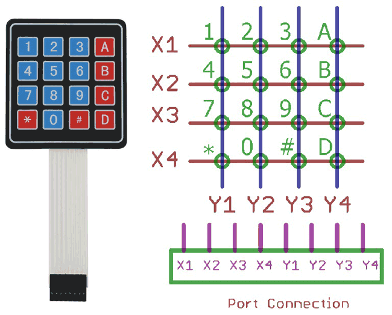
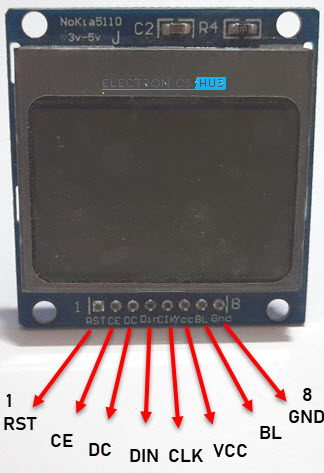
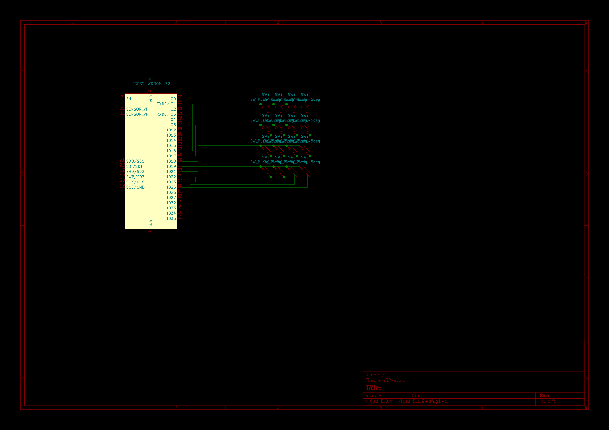

# Esp32DisplayKeyboard
Project of keyboard and display firmware build with FreeRTOS and PlataformIO

<br>

# ESP32 DevKit V1 30 pinouts


<br>


# Keypad 4x4



GPIO   |PIN | FUNC | Direction
-------|----|------|----------
16     | X1 | COL 0| Input
17     | X2 | COL 1| Input
18(*13)| X3 | COL 2| Input       
19     | X4 | COL 3| Input
21     | Y1 | LIN 0| output
22     | Y2 | LIN 1| output
23(*12)| Y3 | LIN 2| output 
25     | Y4 | LIN 3| output

<br>

# Nokia LCD5110



GPIO           |LCD
---------------|---
02             |RST
15             |CE
04             |DC
23  (VSPI_MOSI)|DIN
18  (VSPI_CLK) |CLK
VCC            |VCC
BL             |3.3V (220R)
GND            |GND

<BR>

# Kicad Files

<i>Directory (/hardware) has kicad files</i>


<br>

# Develop Environment

```bash
# Extençoes uteis: 
# code --list-extensions | xargs -L 1 echo code --install-extension
code --install-extension ms-vscode.cpptools
code --install-extension PKief.material-icon-theme
code --install-extension platformio.platformio-ide
code --install-extension QiaoJie.binary-viewer
code --install-extension xaver.clang-format

# Liberacao da porta /dev/ttyACM0 no ubuntu para usuario (logout necessario)
sudo usermod -a -G tty $USER
sudo usermod -a -G dialout $USER
```

<br>

# Optional

```bash
# Simulador de Uno/pic
apt install simulide

# Acesso a serial
sudo apt install minicom

# Serial: /dev/ttyACM0 
# speed: 9600 baund 
# parity: none 
# bits: 7
minicom -s
```

<br>

# References:
- https://www.embarcados.com.br/arduino-vscode-platformio/
- https://randomnerdtutorials.com/esp32-pinout-reference-gpios/
- https://www.fernandok.com/2018/03/esp32-detalhes-internos-e-pinagem.html
- https://www.electronicshub.org/esp32-nokia-5110-lcd/


