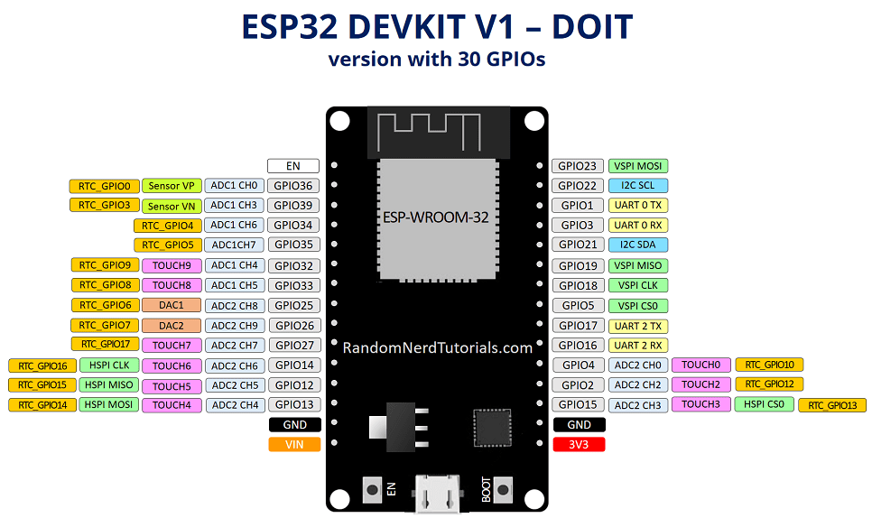

# FreeRTOS e PlataformIO

## Setup

## Hardware

Folder (/hardware) has kicad files

### GPIO Connections
gpio|col|dir
---|---|---
16 | 0 | IN
17 | 1 | IN
18 | 2 | IN
19 | 3 | IN

gpio|lin|dir
---|---|---
21 | 0 | OUT
22 | 1 | OUT
23 | 2 | OUT
25 | 3 | OUT

<br>

## Firmware
```bash
# Extençoes uteis: 
# code --list-extensions | xargs -L 1 echo code --install-extension
code --install-extension ms-vscode.cpptools
code --install-extension PKief.material-icon-theme
code --install-extension platformio.platformio-ide
code --install-extension QiaoJie.binary-viewer
code --install-extension xaver.clang-format

# Liberacao da porta /dev/ttyACM0 no ubuntu para usuario (logout necessario)
sudo usermod -a -G tty $USER
sudo usermod -a -G dialout $USER
```

## Opcionais

```bash
# Simulador de Uno/pic
apt install simulide

# Acesso a serial
sudo apt install minicom

# Serial: /dev/ttyACM0 
# speed: 9600 baund 
# parity: none 
# bits: 7
minicom -s
```

## ref:
- https://www.embarcados.com.br/arduino-vscode-platformio/


